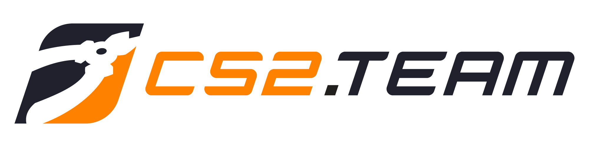

# CS2.TEAM

<div align="center">
	
</div>

---

Find esports teams and players on CS2.TEAM.

## Requirements

Make sure you have Node and NPM installed:

```bash
node -v
# v22.10.0
```

```bash
npm -v
# 10.9.0
```

## Installation

Run the commands:

```bash
npm install
```

```bash
npm run dev
```

## Security Vulnerabilities

Please review our [security policy](https://github.com/CS2TEAM/cs2.team/security/policy) on how to report security vulnerabilities.

## Credits

- [CS2.TEAM](https://github.com/CS2TEAM)
- [All Contributors](https://github.com/CS2TEAM/cs2.team/contributors)

## License

Please see [License File](https://github.com/CS2TEAM/cs2.team/blob/main/LICENSE) for more information.
